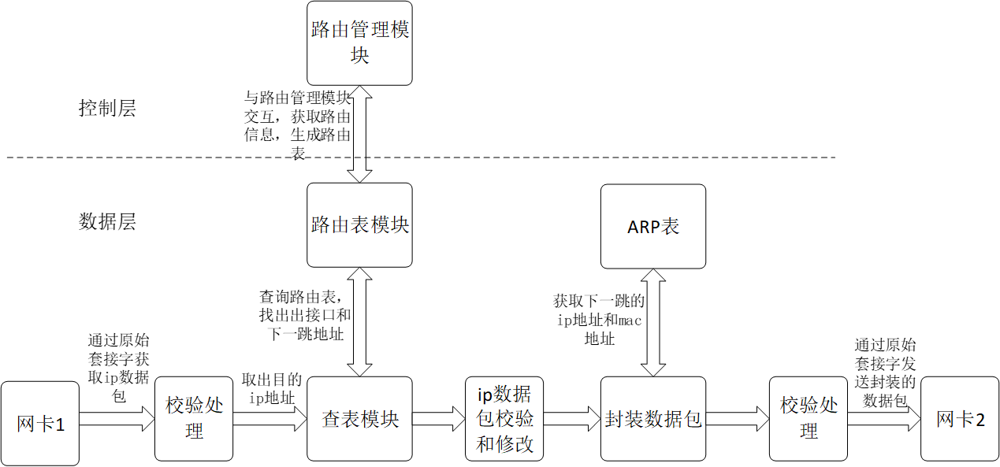

# 网原实验二 Hints by Harry Chen

## 要做什么



数据平面：收到包->校验->查表->修改TTL->重新校验->查询ARP->修改以太网帧->转发

控制平面：从 Quagga 接收数据->改表

## 一些提示

1. 所有系统调用 （`recv`, `send`, `sendto`, `ioctl`）都以 0 为成功返回值，负数是失败，需要检查。

2. 可能用到的一些头文件：

```c
#include <errno.h>
#include <unistd.h>
#include <netinet/if_ether.h>
#include <netpacket/packet.h>
#include <sys/socket.h>
#include <arpa/inet.h>
#include <net/if_arp.h>
#include <net/if.h>
#include <netinet/in.h>
#include <sys/ioctl.h>
#include <netdb.h>
#include <ifaddrs.h>
```

3. 有用的一些结构体：

```c
struct ip  // IPv4 包头，来自 <netinet/ip.h>
struct ether_header // 以太网帧头，来自 <netinet/if_ether.h>
struct in_addr // IPv4 地址，来自 <sys/socket.h>
```

4. 有用的一些转换函数：

```c
ntohl(), htonl(), ntohs(), htons() // 字节序转换
inet_addr("192.168.1.1") // 字符串 -> IP
inet_pton(AF_INET, &(ip_recv_header->ip_src.s_addr), ip_addr_from, INET_ADDRSTRLEN); // IP -> 字符串
if_nametoindex("eth7"); // 从网卡名字查 index
if_indextoname(1, name); // 从网卡 index 查名字
```

5. 接收数据包处理方法：

```c
int recvfd = socket(AF_PACKET, SOCK_RAW, htons(ETH_P_IP);
char skbuf[1514];
recv(recvfd, skbuf, sizeof(skbuf);
// 以太网头（始终是14字节）
struct ether_header *eth_header = (struct ether_header *)skbuf;
// ip 头
struct ip *ip_recv_header = (struct ip *)(skbuf + sizeof(struct ether_header));
// ip 头长度（单位是字节）
uint16_t header_length = ip_recv_header->ip_hl * 4;
// 实际数据（没有用）
char *payload = (char *)(skbuf + sizeof(struct ether_header) + header_length);
```

6. `lookup_route()` 与 `arpGet()` 都有一个参数是指针，由调用者分配，函数中向里面存放返回的值。

7. 查 ARP 的方法：

```c
struct arpreq arp_req;
struct sockaddr_in *sin;

sin = (struct sockaddr_in *)&(arp_req.arp_pa);

memset(&arp_req, 0, sizeof(arp_req));
sin->sin_family = AF_INET;

// 1.1.1.1 is the IP of next hop
inet_pton(AF_INET, "1.1.1.1", &(sin->sin_addr));
// or you can
sin->sin_addr.s_addr = inet_addr("1.1.1.1");

// eth1 is the name of interface of next hop
strncpy(arp_req.arp_dev, "eth1", IF_NAMESIZE - 1);

int arp_fd = socket(AF_INET, SOCK_DGRAM, 0)
int ret = ioctl(arp_fd, SIOCGARP, &arp_req);

// be careful with the return value!
if (ret < 0) {
    fprintf(stderr, "Get ARP entry failed for %s @%s : %s\n", ip_str, if_name, strerror(errno));
    exit(EXIT_FAILURE);
}

if (arp_req.arp_flags & ATF_COM) {
    // entry found
    unsigned char mac[6];
    // the mac address can be directed copied to eth_header->ether_dhost
    memcpy(mac, (unsigned char *)arp_req.arp_ha.sa_data, sizeof(macaddr_t));
    printf("Destination MAC Address: %02x:%02x:%02x:%02x:%02x:%02x\n",
        mac[0], mac[1], mac[2], mac[3], mac[4], mac[5]);
} else {
    // entry not found
}

// always remember to close it
close(arp_fd);

```

8. 查某个 interface 的 MAC 的方法：

```c
struct ifreq ifr;

int sockfd = socket(AF_INET, SOCK_DGRAM, 0);

strncpy(ifr.ifr_name, "eth1", IF_NAMESIZE);

if (ioctl(sockfd, SIOCGIFHWADDR, &ifr) == 0) {
    memcpy(mac_a, ifr.ifr_hwaddr.sa_data, 6);
} else {
    // something really goes wrong here, doesn't it?
}

close(sockfd);
```

9. 发包的方法：

首先确保 IP 头、以太网头都正确修改了。

```c
int sendfd = socket(AF_PACKET, SOCK_RAW, IPPROTO_RAW);

struct sockaddr_ll sadr_ll;
sadr_ll.sll_ifindex = 0; // index of next hop
sadr_ll.sll_halen = ETH_ALEN;
// mac_addr_to is the result of arp query
memcpy(sadr_ll.sll_addr, mac_addr_to, ETH_ALEN);

// length should be equal to the length you receive from raw socket
if ((result = sendto(sendfd, skbuf, length, 0,
                        (const struct sockaddr *)&sadr_ll,
                        sizeof(struct sockaddr_ll))) == -1) {
    // send error
} else {
    // send succeed
}

close(sendfd);
```

10. 建立 socket 收控制数据：

```c
int sock_fd;
struct sockaddr_in server_addr;

sock_fd = socket(AF_INET, SOCK_STREAM, 0)

bzero(&server_addr, sizeof(struct sockaddr_in));
server_addr.sin_family = AF_INET;
server_addr.sin_addr.s_addr = inet_addr("127.0.0.1");
server_addr.sin_port = htons(800);

bind(sock_fd, (struct sockaddr *)(&server_addr), sizeof(struct sockaddr);
listen(sock_fd, 5);

struct selfroute selfrt;

while (1) {
    int conn_fd = accept(sock_fd, (struct sockaddr *)NULL, NULL);
    ret = recv(conn_fd, &selfrt, sizeof(struct selfroute), 0);
    // do something with selfrt
    close(conn_fd);
}

```

## 实验框架一些问题

### 高严重性

* `skbuf` 长度不够，应至少 1514

### 中严重性

* `selfroute` 结构体的 `ifname` 长度不够，应为 `IF_NAMESIZE` (`<net/if.h>`)
* `insert_route` 中 `ip4prefix` 和 `nexthop` 类型错误，应该使用 `uint32_t` (`<stdint.h>`)
* 不应该自定义 `_iphdr` 类型，导致潜在类型不一致问题，应使用 `struct ip` (`<netinet/ip.h>`)

### 意义不明的坑

* 对路由表三个操纵函数接受的 ip 类型不一致（本质上是端序不一致）
* 存储“下一跳”信息用了三个 field 类似但名称不同的数据结构
* `thr_fn` 中每次暴力查询 interface ，应该使用 `if_indextoname` (`<net/if.h>`)
* 主程序对 payload 的无意义拷贝
* struct 传参的无意义 `malloc()`，直接传参和返回即可
* 多处混用 `struct ip` 和 `struct iphdr`，后者已经被 Linux 弃用
* 计算校验和无需传入 `length`，应该直接从 IP 包头读取
* 使用了大量机器相关的字长(short/int)，应该使用 `<stdint.h>` 中的 `uint32_t`/`uint16_t` 等

## 性能优化提示

* 尽量减少拷贝
* 用简单方法计算校验和
* 路由表缓存